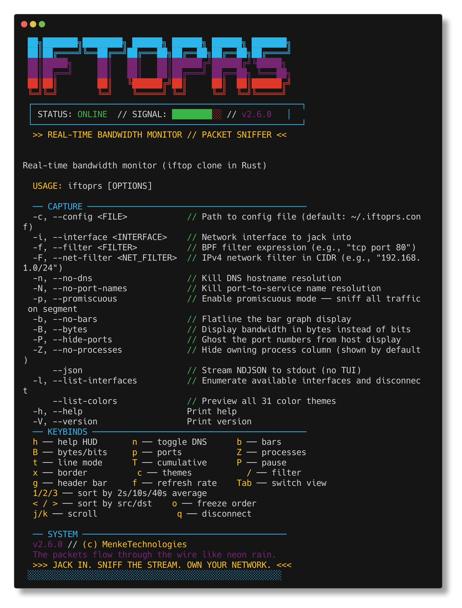
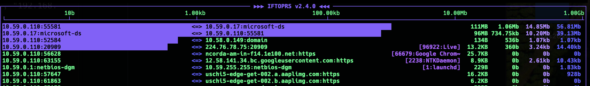

```
 ██╗███████╗████████╗ ██████╗ ██████╗ ██████╗ ███████╗
 ██║██╔════╝╚══██╔══╝██╔═══██╗██╔══██╗██╔══██╗██╔════╝
 ██║█████╗     ██║   ██║   ██║██████╔╝██████╔╝╚█████╗
 ██║██╔══╝     ██║   ██║   ██║██╔═══╝ ██╔══██╗ ╚═══██╗
 ██║██║        ██║   ╚██████╔╝██║     ██║  ██║██████╔╝
 ╚═╝╚═╝        ╚═╝    ╚═════╝ ╚═╝     ╚═╝  ╚═╝╚═════╝
```

<p align="center">
  <a href="https://github.com/MenkeTechnologies/iftoprs/actions/workflows/ci.yml"></a>
  <a href="https://crates.io/crates/iftoprs"></a>
  <a href="https://crates.io/crates/iftoprs"></a>
  <a href="https://docs.rs/iftoprs"></a>
  <a href="https://github.com/MenkeTechnologies/iftoprs/blob/main/LICENSE"></a>
</p>

<p align="center">
  <code>[ SYSTEM://NET_INTERCEPT v2.0 ]</code><br>
  <code> JACKING INTO YOUR PACKET STREAM </code><br><br>
  <strong>A neon-drenched terminal UI for real-time bandwidth monitoring</strong><br>
  <em>Built in Rust with <a href="https://github.com/ratatui/ratatui">ratatui</a> + <a href="https://github.com/crossterm-rs/crossterm">crossterm</a> + <a href="https://docs.rs/pcap">pcap</a></em><br><br>
  <code>created by MenkeTechnologies</code>
</p>

<p align="center">
  
</p>


```bash
cargo install iftoprs
```

---

```
 ▄▄▄▄▄▄▄▄▄▄▄▄▄▄▄▄▄▄▄▄▄▄▄▄▄▄▄▄▄▄▄▄▄▄▄▄▄▄▄▄▄▄▄▄▄▄▄▄▄▄▄
 █ >> INITIALIZING PACKET INTERCEPT...                 █
 █ >> STATUS: ALL INTERFACES NOMINAL                   █
 ▀▀▀▀▀▀▀▀▀▀▀▀▀▀▀▀▀▀▀▀▀▀▀▀▀▀▀▀▀▀▀▀▀▀▀▀▀▀▀▀▀▀▀▀▀▀▀▀▀▀▀
```

### `> FEATURE_DUMP.exe`

```
[CAPTURE_ENGINE]
  ├── Live packet capture ─── libpcap / BPF filters
  │   ├── per-flow bandwidth tracking
  │   ├── sliding window averages: 2s / 10s / 40s
  │   ├── cumulative + peak counters
  │   └── async capture via tokio + mpsc channels
  │
[TELEMETRY_CORE]
  ├── Real-time flow analysis
  │   ├── source ↔ destination pair tracking
  │   ├── protocol detection: TCP / UDP / ICMP / Other
  │   ├── DNS reverse resolution (async, cached)
  │   ├── port-to-service name mapping
  │   └── log10 bandwidth scale: 10b → 1Gb
  │
[PROCESS_INTEL]
  ├── Flow-to-process attribution
  │   ├── PID + process name per connection
  │   ├── background polling via Arc<Mutex<>>
  │   ├── lsof-based socket→process mapping
  │   ├── per-process aggregated bandwidth view (Tab key)
  │   └── drill-down: Enter on process → filtered flows, Esc to clear
  │
[TOOLTIP_SYSTEM]
  ├── Rich contextual tooltips on hover + right-click
  │   ├── right-click flow rows ── TX/RX rates, totals, process, sparkline
  │   ├── hover header bar segments ── 1s delay, 3s auto-hide
  │   ├── right-click header ── instant tooltip, persistent until dismissed
  │   ├── segment tooltips: app info, interface, flows, clock, sort,
  │   │   refresh rate, theme, filter, paused state, help
  │   └── 9-15 lines per segment: config fields, sources, key hints
  │
[SPARKLINE]
  ├── Per-flow bandwidth sparkline (▁▂▃▅▇█)
  │   ├── shown on row below selected flow (40s history)
  │   └── shown in right-click tooltip
  │
[JSON_STREAM]
  ├── --json flag ── headless NDJSON output (no TUI)
  │   ├── streams flow snapshots to stdout
  │   ├── includes rates, totals, process info
  │   └── pipe to jq, log to file, feed dashboards
  │
[INTERFACE_DECK]
  ├── Sort ─── 2s avg / 10s avg / 40s avg / src name / dst name
  ├── Display ─── bits or bytes / bars on/off / ports on/off
  ├── Line modes ─── two-line / one-line / sent-only / recv-only
  ├── Freeze ─── lock current sort order
  └── Color-coded rate columns ─── yellow(2s) / green(10s) / cyan(40s)
  │
[NET_FILTER]
  ├── BPF filter expressions ─── "tcp port 80", "host 10.0.0.1"
  ├── CIDR network filter ─── auto-detect or manual (-F)
  ├── Promiscuous mode ─── capture all traffic on segment
  └── Interface selection ─── list + choose
  │
[PLATFORM_COMPAT]
  ├── macOS ── SUPPORTED
  ├── Linux ── SUPPORTED
  └── requires libpcap (root/sudo for raw capture)
  │
[THEME_ENGINE]
  ├── 31 builtin cyberpunk color themes (including iftopcolor)
  │   ├── live theme chooser (c key)
  │   ├── swatch preview per theme
  │   └── persistent selection via ~/.iftoprs.conf
  │
[FLOW_SELECTION]
  ├── j/k ── select next/prev flow
  ├── Ctrl+d/u ── half-page scroll
  ├── G/Home ── jump to last/first
  ├── y ── copy selected flow to clipboard
  ├── F ── pin/unpin flow (★ floats to top)
  └── Esc ── deselect
  │
[FILTER_ENGINE]
  ├── / ── live filter by hostname/IP
  ├── 0 ── clear filter
  ├── Ctrl+w ── delete word
  └── Ctrl+k ── kill to end of line
  │
[EXPORT]
  ├── e ── export all flows to ~/.iftoprs.export.txt
  └── includes per-flow rates + TX/RX totals
  │
[ALERT_SYSTEM]
  ├── Bandwidth threshold alerts ── configurable in ~/.iftoprs.conf
  │   ├── red border flash on threshold crossing
  │   ├── terminal bell (\x07) notification
  │   └── status bar message: ⚠ ALERT: hostname rate/s
  │
[CONFIG_ENGINE]
  ├── Auto-save ── every toggle writes to ~/.iftoprs.conf
  ├── Default config ── created on first run if missing
  ├── Reference config ── iftoprs.default.conf with full docs
  └── TOML format ── human-readable, hand-editable
  │
[SHELL_COMPLETION]
  ├── Zsh completions ── completions/_iftoprs
  └── --completions flag ── zsh / bash / fish / elvish / powershell
```

---

### `> RENDER_PREVIEW.dat`

#### `// LIVE_CAPTURE`

<p align="center">
  
</p>

---

### `> REQUIRED_IMPLANTS.cfg`

```
RUST_VERSION  >= 1.85  [2024 edition]
TARGET_OS     == macOS || Linux
LIBPCAP       == installed (system dependency)
```

| `IMPLANT` | `PURPOSE` |
|:---:|:---|
| `ratatui` 0.30 | TUI rendering framework |
| `crossterm` 0.29 | Terminal events + manipulation |
| `pcap` 2.4 | Packet capture via libpcap |
| `tokio` 1.50 | Async runtime + channels |
| `clap` 4.6 | CLI argument parsing |
| `dns-lookup` 3.0 | Reverse DNS resolution |
| `regex` 1.12 | Pattern matching for filters |
| `chrono` 0.4 | Time operations |
| `anyhow` 1.0 | Error handling |
| `clap_complete` 4 | Shell completion generation |
| `serde` 1.0 | Config serialization |
| `serde_json` 1.0 | JSON streaming output |
| `toml` 1.1 | Config file format |
| `dirs` 6.0 | Home directory detection |

---

### `> COMPILE_SEQUENCE.sh`

```bash
# ── JACK IN ──────────────────────────────────
cargo build --release
# LTO enabled ── symbols stripped ── lean binary
```

```bash
# ── BOOT THE SNIFFER ─────────────────────────
sudo cargo run --release
# or go direct:
sudo ./target/release/iftoprs
```

### `> CI_AND_QA.sh`

[GitHub Actions](https://github.com/MenkeTechnologies/iftoprs/actions/workflows/ci.yml) runs on every push and pull request to `main`, and can be started manually (**workflow_dispatch** from the Actions tab).

| Job | Command |
|:---:|:---|
| Format | `cargo --locked fmt --all --check` |
| Clippy | `cargo clippy --all-targets --locked -- -D warnings` |
| Test | `cargo build --locked` and `cargo test --locked` |

Integration tests in **`tests/integration.rs`** execute the built **`iftoprs`** binary via **`CARGO_BIN_EXE_iftoprs`** (not `cargo run`), so CLI output is read directly from the process and stays reliable in CI.

The **Test** job uses **Ubuntu** and **macOS** runners. On Linux, **apt** installs **`libpcap-dev`** for the **Clippy** and **Test** jobs (the **Format** job does not link `pcap` and does not install it). The repo [`rust-toolchain.toml`](rust-toolchain.toml) pins **stable** Rust with `rustfmt` and `clippy` so local and CI toolchains stay aligned. The workflow uses **least-privilege** `contents: read` permissions and **cancels in-progress runs** on the same branch when a newer commit is pushed, so redundant builds do not pile up. Jobs have **timeouts** (format, clippy, and test) so hung runners do not run indefinitely. The test matrix sets **fail-fast: false** so both operating systems finish even when one fails, which makes cross-platform regressions easier to diagnose.

Run the same checks locally before pushing:

```bash
cargo --locked fmt --all --check
cargo clippy --all-targets --locked -- -D warnings
cargo test --locked
```

**Testing:** Unit tests in `src/` focus on **deterministic** behavior (flow keys, packet and **`/etc/services`** parsing, bandwidth history, preferences, **TUI** helpers such as **`trunc`** and **rate→bar** scaling in `ui/render.rs`). **Linux** and **macOS** each run **additional** unit tests for OS-specific helpers (`parse_proc_net_port` vs `extract_local_port`). Integration tests in **`tests/integration.rs`** drive the real **`iftoprs`** binary via **`CARGO_BIN_EXE_iftoprs`**.

**Test output:** `cargo test` prints one **`running N tests`** line per test binary (library, **`iftoprs`** binary harness, and integration crate). Summing those three numbers is the total **test executions** in one full run. The library and binary harnesses both run the crate’s unit tests (with a small difference if `main.rs` adds extra tests), so that sum is **not** a count of unique `#[test]` functions.

**`Cargo.lock` is committed** to the repository (this is an application, not a library-only crate) so clean checkouts and CI always have a lockfile. CI uses **`--locked`** so the build fails if `Cargo.lock` is out of date with `Cargo.toml` instead of silently refreshing lockfile entries on the runner. After changing dependencies in `Cargo.toml`, run `cargo build` or `cargo update` locally and commit the updated `Cargo.lock`.

The **actions/cache** keys hash **`Cargo.lock`** and **`rust-toolchain.toml`**, so upgrading the pinned toolchain or changing dependencies invalidates old `target/` artifacts instead of reusing a stale build. Each cache step also sets **`restore-keys`** to a runner-specific prefix so a prior job’s cache can partially warm the next build when the exact key misses. The **Test** job sets **`RUST_BACKTRACE=1`** so panics print useful stack traces in CI logs.

**Port-to-service** labels read the system **`/etc/services`** file; entries and ordering vary by OS. Unit tests use **`tests/fixtures/minimal_etc_services.txt`** for deterministic expectations, and the parser normalizes **`tcp`** / **`udp`** protocol casing so lookups stay consistent while **preserving the service name string** as written (including **ALL‑CAPS** names). Additional resolver tests cover **port 65535**, **input without a trailing newline**, **slashes inside the service name token**, **curly braces**, **`%`**, **apostrophe**, **backslash**, **asterisk**, **`=`**, **`|`**, **`;`**, **`^`**, **`?`**, and **angle brackets** (`<` / `>`), and **backticks**, and **`#`** (when not starting the line as a **comment**), and **Unicode** symbols such as the **euro** (**€**), **en dash** (U+2013), **em dash** (U+2014), and **middle dot** (U+00B7) and **soft hyphen** (U+00AD) and **word joiner** (U+2060) and **right-to-left mark** (U+200F) and **superscript two** (U+00B2) and the **emoji variation selector** (U+FE0F) and the **zero-width joiner** (U+200D) and **Greek alpha** (U+03B1) inside the service name token (**NBSP** U+00A0 is Unicode whitespace in Rust and splits **`split_whitespace`** tokens, so it is not preserved as part of the name). A few resolver smoke tests assert against the live file when it is readable and **return early** when it is missing or empty (minimal containers, Windows), so CI stays green without pinning OS-specific service names.

Additional **packet parser** and **`/etc/services` parser** unit tests cover VLAN and cooked (**SLL**) frames (**802.1Q** tag parsing (**IPv4** / **IPv6** inner frames), **SLL** (**Linux cooked**) with **TCP** and a **local CIDR**, including **direction** when **`-F`** is set), ICMP (no L4 ports), invalid IP versions, **truncated IPv4 or IPv6 payloads** (Ethernet, VLAN, **SLL**, **DLT_RAW**) shorter than the minimum IP header length, **raw IPv4** (**DLT_RAW**) **UDP** **direction** with a **`-F`** local CIDR, **BSD loopback** (**DLT_NULL**) including a minimal **AF_INET** ICMP frame and **TCP** **direction** with a **`-F`** local CIDR, rejects unknown or zero address families (or **AF_INET** / **AF_INET6** with only the 4-byte family header and no IP payload — **AF_INET6** uses **10** on Linux and **30** on macOS), **CIDR** edge cases (including **`/0`**, prefix lengths beyond **`/32`** or **`/128`** behaving as exact-host match, IPv4 **`/9`** / **`/10`** / **`/11`** / **`/12`** / **`/13`** / **`/14`** / **`/15`** / **`/17`** / **`/18`** / **`/19`** / **`/20`** / **`/21`** / **`/22`** / **`/23`** / **`/25`** / **`/26`** / **`/27`** / **`/28`** / **`/29`**, IPv6 **`/56`** link-local matching, IPv6 **`/64`** on **`fd00::`**, **`/96`** and **`/112`** on **`2001:db8::`**, **CLI** `-F` parsing for IPv6 nets such as **`::/0`**, **`64:ff9b::/96`** (NAT64 well-known prefix; **`ip_in_network`** on **`64:ff9b::/96`** vs **global** unicast), **`2001::/32`** (Teredo / IPv6 Internet), **`2002::/16`** (6to4), **`fc00::/7`**, **`fd00::/8`**, **`fe80::1/127`**, **`ff02::/16`** (link-local multicast; **`ip_in_network`** **`-F`** checks vs **link-local unicast** **`fe80::`**), **`::/0`** (all IPv6 addresses), **`2001:db8::/32`**, **`2001:db8:1::/48`** (documentation sub-prefix), **`2001:2::/48`** (benchmarking), **`2001:10::/28`** (ORCHID-style prefix), **`fe80::/64`** (link-local subnet), **`fe80::/10`** (link-local scope; **`ip_in_network`** **boundary** vs **`fe7f::`** / **`febf::`**), **`ff00::/8`** (IPv6 multicast), **`ff03::/16`** (subnet-local multicast scope; **`ip_in_network`** vs **`ff02::`** link-local multicast), **`ff04::/16`** (admin-local multicast scope; **`ip_in_network`** vs **`ff03::`** subnet-local multicast), **`ff05::/16`** (site-local multicast scope; **`ip_in_network`** vs **`ff04::`** admin-local multicast), **`ff06::/16`** (IPv6 **multicast** scope **0x6**; **`ip_in_network`** vs **`ff05::`** site-local multicast), **`ff07::/16`** (IPv6 **multicast** scope **0x7**; **`ip_in_network`** vs **`ff06::`** scope **0x6**), **`ff08::/16`** (IPv6 **multicast** scope **0x8**; **`ip_in_network`** vs **`ff07::`** scope **0x7**), **`ff09::/16`** (IPv6 **multicast** scope **0x9**; **`ip_in_network`** vs **`ff08::`** scope **0x8**), **`ff0a::/16`** (IPv6 **multicast** scope **0xA**; **`ip_in_network`** vs **`ff09::`** scope **0x9**), **`ff0b::/16`** (IPv6 **multicast** scope **0xB**; **`ip_in_network`** vs **`ff0a::`** scope **0xA**), **`ff0c::/16`** (IPv6 **multicast** scope **0xC**; **`ip_in_network`** vs **`ff0b::`** scope **0xB**), **`ff0d::/16`** (IPv6 **multicast** scope **0xD**; **`ip_in_network`** vs **`ff0c::`** scope **0xC**), **`ff0e::/16`** (IPv6 **multicast** scope **0xE**; **`ip_in_network`** vs **`ff0d::`** scope **0xD**), **`ff0f::/16`** (IPv6 **multicast** scope **0xF**; **`ip_in_network`** vs **`ff0e::`** scope **0xE**), **`ff10::/16`** (IPv6 **multicast** scope **0x10**; **`ip_in_network`** vs **`ff0f::`** scope **0xF**), **`ff11::/16`** (IPv6 **multicast** scope **0x11**; **`ip_in_network`** vs **`ff10::`** scope **0x10**), **`ff12::/16`** (IPv6 **multicast** scope **0x12**; **`ip_in_network`** vs **`ff11::`** scope **0x11**), **`ff13::/16`** (IPv6 **multicast** scope **0x13**; **`ip_in_network`** vs **`ff12::`** scope **0x12**), **`ff14::/16`** (IPv6 **multicast** scope **0x14**; **`ip_in_network`** vs **`ff13::`** scope **0x13**), **`ff15::/16`** (IPv6 **multicast** scope **0x15**; **`ip_in_network`** vs **`ff14::`** scope **0x14**), **`ff16::/16`** (IPv6 **multicast** scope **0x16**; **`ip_in_network`** vs **`ff15::`** scope **0x15**), **`ff17::/16`** (IPv6 **multicast** scope **0x17**; **`ip_in_network`** vs **`ff16::`** scope **0x16**), **`ff18::/16`** (IPv6 **multicast** scope **0x18**; **`ip_in_network`** vs **`ff17::`** scope **0x17**), **`ff19::/16`** (IPv6 **multicast** scope **0x19**; **`ip_in_network`** vs **`ff18::`** scope **0x18**), **`::ffff:0:0/96`** (IPv4-mapped IPv6 well-known prefix), **`::/128`** (unspecified **all-zero** address; **`ip_in_network`** on **`::/128`** vs **`::1`**), **`::1/128`** (loopback host; **`ip_in_network`** host-only **`::1/128`** vs **`::2`**), **`fd00::/8`** (unique local assignment; **`ip_in_network`** vs **`fc00::`**), **`2002::/16`** (6to4), **IPv4** **`/2`** (quarter-Internet mask), **6to4** **`2002::/16`** **`ip_in_network`** range (vs **non-6to4** **unicast**), **RFC 1918** private **A** **`10.0.0.0/8`** (vs **`11.0.0.1`** outside the block), and **host-only** IPv4 **`192.168.0.1/32`**, **private LAN** **`192.168.0.0/20`**, **`192.168.0.0/16`** (common home-router aggregate), **broadcast** **`255.255.255.255/32`** (including **`ip_in_network`** on the **limited broadcast** host-only **`/32`**), **unspecified** **`0.0.0.0/32`**, **loopback** **`127.0.0.0/8`**, **default IPv4 route** **`0.0.0.0/0`**, **invalid** filters with **extra slashes** (including a **double slash** in the CIDR token), an **empty prefix** after **`/`**, **ASCII spaces** inside the **`-F`** CIDR token (`10.0.0.0 /24`, `10.0.0.0/ 24`), **tab** before **`/`** (`10.0.0.0\t/24`), **trailing space** after the **prefix** (`/24 `), **carriage return** after the **prefix** (`/24\r` — **not** valid **`-F`** input), **line feed** after the **prefix** (`/24\n`), **NUL** after the **prefix** (`/24` + **`\0`**), **vertical tab** / **form feed** / **narrow no-break space** (U+202F) after the **numeric prefix** (invalid **`-F`** input), **line** / **paragraph** **separators** (U+2028 / U+2029) and **next-line** (U+0085) after the **prefix**, **NBSP** (U+00A0), **left-to-right mark** (U+200E), **right-to-left mark** (U+200F), **left-to-right isolate** (U+2066), **right-to-left isolate** (U+2067), **zero-width non-joiner** (U+200C), **combining grapheme joiner** (U+034F), **zero-width joiner** (U+200D), **first strong isolate** (U+2068), **inhibit symmetric swapping** (U+206A), **activate symmetric swapping** (U+206B), **inhibit Arabic form shaping** (U+206C), **activate Arabic form shaping** (U+206D), **national digit shapes** (U+206E), **nominal digit shapes** (U+206F), **zero-width space** (U+200B), **figure space** (U+2007), **en space** (U+2002), **em space** (U+2003), **punctuation space** (U+2008), **thin space** (U+2009), **hair space** (U+200A), **en quad** (U+2000), **em quad** (U+2001), **four-per-em space** (U+2005), **three-per-em space** (U+2004), **six-per-em space** (U+2006), **Arabic letter mark** (U+061C), **Mongolian vowel separator** (U+180E), **left-to-right embedding** (U+202A), **right-to-left embedding** (U+202B), **pop directional formatting** (U+202C), **left-to-right override** (U+202D), **right-to-left override** (U+202E), **function application** (U+2061), **invisible times** (U+2062), **invisible separator** (U+2063), **combining grave accent** (U+0300), **combining acute accent** (U+0301), **combining circumflex accent** (U+0302), **combining tilde** (U+0303), **combining macron** (U+0304), **combining overline** (U+0305), **combining breve** (U+0306), **combining dot above** (U+0307), **combining diaeresis** (U+0308), **combining hook above** (U+0309), **combining ring above** (U+030A), **combining double acute accent** (U+030B), **combining caron** (U+030C), **combining vertical line above** (U+030D), **combining double vertical line above** (U+030E), **combining double grave accent** (U+030F), **combining candrabindu** (U+0310), **combining inverted breve** (U+0311), **combining turned comma above** (U+0312), **combining comma above** (U+0313), **word joiner** (U+2060), **invisible plus** (U+2064), **soft hyphen** (U+00AD), **BOM** (U+FEFF), **pop directional isolate** (U+2069), and **replacement character** (U+FFFD) after the **prefix**, **invalid** **negative** prefix (`/-1`), **prefix** **`/256`** (does not fit **`u8`**), **empty** address before **`/`** (`/24`), **leading-zero** decimal **prefix** digits on the **`-F`** token (`192.168.0.0/024` → **prefix** **24**), **garbage after a numeric prefix** (`/24abc`), **no** **`/`** at all, a **bare IPv6 address** without **`/prefix`**, **`ip_in_network`** with a **non-zero host portion** in the **network** argument (still **bitwise-AND** correct), **IPv4** **`/32`** **host** **mismatch** (**`192.0.2.1/32`** vs **`192.0.2.2`**), **IPv4** **network** address on a **subnet** (**`192.168.1.0/24`**), **IPv4** **`/26`** **RFC 1918** **boundary** (**`10.0.0.0/26`**), **IPv4** **`/20`** **private** **class B** **boundary** (**`172.16.0.0/20`**), **IPv6** **`/127`** **point-to-point** **boundary** (**`2001:db8::/127`** vs **`2001:db8::2`**), **IPv6** **global unicast** **`2000::/3`** vs **`4000::`**, **IPv6** **multicast** **`ff00::/12`** vs **non-multicast** **`fe00::`**, **IPv6** **`::ffff:0:0/96`** **IPv4-mapped** **well-known** prefix vs **global** unicast, **IPv6** **ULA** **`fd00::/64`** ( **`fd00::1`** in-net, **`fd01::1`** out-of-net ), **IPv4-mapped** IPv6 **`::ffff:…/128`** **host-only** **matching**, **IPv4** **subnet broadcast** as **destination** (e.g. **`192.168.1.255`** in **`192.168.1.0/24`**), **`2001:db8:1::/48`** vs **`2001:db8:2::/48`** (**`ip_in_network`** on **documentation** **subnets**), **CIDR** checks for **CGNAT** **`100.64.0.0/10`** (carrier-grade NAT shared space) alongside other IPv4 **`/10`** cases, IPv4 **multicast** **`224.0.0.0/4`**, **IPv4 class E reserved** **`240.0.0.0/4`**, **documentation** **`192.0.2.0/24`** (TEST-NET-1), **`198.51.100.0/24`** (TEST-NET-2), **`203.0.113.0/24`** (TEST-NET-3), **RFC 2544** benchmark **`198.18.0.0/15`**, **RFC 1918** private **B** **`172.16.0.0/12`**, **IPv4** link-local **APIPA** **`169.254.0.0/16`**, **`ip_in_network`** on **ORCHID** **`2001:10::/28`**, **Teredo** **`2001::/32`**, **benchmarking** **`2001:2::/48`**, **unique local IPv6** **`fc00::/7`** (e.g. **`fd00::/8`** inside the block, **link-local** **`fe80::`** outside), and **`/etc/services`** lines with **decimal ports** that include **leading zeros**, **fullwidth** Unicode **digit** characters in the **port** token (skipped; **not** ASCII **`0`–`9`**), **Arabic-Indic** digits (U+0660–U+0669), **Devanagari** digits (U+0966–U+096F), **Bengali** digits (U+09E6–U+09EF), **Thai** digits (U+0E50–U+0E59), **Khmer** digits (U+17E0–U+17E9), **Myanmar** digits (U+1040–U+1049), **Tibetan** digits (U+0F20–U+0F29), **Mongolian** digits (U+1810–U+1819), **Oriya** digits (U+0B66–U+0B6F), **Lao** digits (U+0ED0–U+0ED9), **Kannada** digits (U+0CE6–U+0CEF), **Malayalam** digits (U+0D66–U+0D6F), **Telugu** digits (U+0C66–U+0C6F), **Gujarati** digits (U+0AE6–U+0AEF), **Gurmukhi** digits (U+0A66–U+0A6F), **Sinhala** digits (U+0DE6–U+0DEF), **Balinese** digits (U+1B50–U+1B59), **Javanese** digits (U+A9D0–U+A9D9), **Ethiopic** digits (U+1369–U+1371), **Cherokee** digits (U+13F0–U+13F9), **Meetei Mayek** digits (U+ABF0–U+ABF9), **Osmanya** digits (U+104A0–U+104A9), **Adlam** digits (U+1E950–U+1E959), **Nyiakeng Puachue Hmong** digits (U+16B50–U+16B59), **Hanifi Rohingya** digits (U+10D30–U+10D39), **Chakma** digits (U+11136–U+1113F), **Takri** digits (U+116C0–U+116C9), **Ahom** digits (U+11730–U+11739), **Wancho** digits (U+11BF0–U+11BF9), **Mro** digits (U+16A60–U+16A69), **Brahmi** digits (U+11066–U+1106F), **Sharada** digits (U+111D0–U+111D9), **Sora Sompeng** digits (U+110F0–U+110F9), and **New Tai Lue** digits (U+19D0–U+19D9) in the **port** token (skipped), a **missing port token** (`ssh /tcp`), **non-integer port tokens** (`22.5/tcp`), **`@` inside the service name token**, **`:` inside the service name token** (not a comment), **`!` inside the service name token**, **`&` inside the service name token**, **`~` inside the service name token**, **`$` inside the service name token**, **`(` / `)` inside the service name token**, **`[` / `]` inside the service name token**, **extra whitespace between the service name and port field**, **indented full-line `#` comments**, **commas inside the service name token**, a **leading blank line** before the first entry, or **blank-only** lines between entries, so regressions show up on **Ubuntu** and **macOS** without live capture hardware.

**Flow and history** unit tests cover **non-normalized** reversed **`FlowKey`** pairs as **distinct** tracker rows (until keys are canonicalized upstream), **IPv4-mapped** IPv6 **`::ffff:…`** vs **global** unicast **`FlowKey`** **normalize** ordering, **multicast** **`ff02::…`** vs **global** unicast **`FlowKey`** **normalize** ordering, **same IPs with different ports** (including **swapped** **src**/**dst** **ports** on **unchanged** **IPv4** **or** **IPv6** **endpoints**) or **different IP protocols** (**TCP** vs **UDP**, **TCP** vs **ICMP**, **UDP** vs **ICMP**, **TCP** vs **`Protocol::Other`** (e.g. **GRE** **47**), **ICMP** vs **`Protocol::Other`** (e.g. **ESP** **50**) with **zero** **L4** ports, **UDP** vs **`Protocol::Other`** (**SCTP** **132**), **`Protocol::Tcp`** vs **`Protocol::Other(6)`** (same **IANA** number as **TCP** but **not** the **`Tcp`** enum variant), **`Protocol::Udp`** vs **`Protocol::Other(17)`** (same **IANA** number as **UDP** but **not** **`Udp`**), **ICMP** vs **UDP** with **zero** **L4** ports on **both** sides, or **two** **`Protocol::Other`** values with **different** **IANA** numbers, with identical endpoints) as **separate** flows (**`FlowKey`** **inequality** when only **`Protocol`** differs), **recv-only** vs **send-only** sliding-window averages, **40s** sent and **recv** window sums with **eleven** completed slots, **40s** recv window parity with **2s** on a single slot, **fresh** sliding-window averages (**2s** / **40s**) at **zero** before any bytes are recorded, **peak sent** and **peak recv** tracked **independently** across **history** rotations, **monotonic** **peak sent** and **peak recv** across **rotations** (each **tracks** its **max** **slot** **rate**), **IPv6-NoNxt** (**59**), **DCCP** (**33**), **UDP-Lite** (**136**), **RSVP** (**46**), **IPv6 encapsulation** (**41**), **MANET** (**138**), **Fibre Channel** (**133**), **ROHC** (**142**), **Ethernet-in-IP** (**143**), **IANA** protocol numbers **144–255** (full **`u8`** space for **`Protocol::Other`** beyond **TCP** / **UDP** / **ICMP**), **HIP** (**139**), **MPLS** (**137**), **L2TP** (**115**) as **`Protocol::Other`**, **`readable_size`** crossing from **b** into the **kb** tier when the bit rate exceeds **1000 b/s**, **signed** negative rates in **`readable_size`** (defensive display), **`readable_total`** **terabyte**-tier display for **very large** cumulative byte totals (including **exactly** **one decimal terabyte**), **`readable_total`** **just below** **one decimal terabyte** (**10¹²** bytes; **SI-style** **KB**/**MB**/**GB**/**TB** steps) staying on the **GB** tier until the **TB** branch, **sparkline** **block** scaling with **alternating** **zero** and **maximum** samples, **uniform** **mid-range** plateaus, a **high** **plateau** with a **single** **low** tail sample, a **flat** run with a **single** **spike**, and a **zero** run stepping to **max** on the **last** sample, **builtin** theme **`display_name`** strings are **non-empty** and **pairwise unique** across **`ThemeName::ALL`**, **`prefs`** **`alert_threshold`** **floating-point** TOML roundtrip, **prefs** roundtrips for themes such as **Neon Sprawl**, **Red Sector**, **Sakura Den**, **Ghost Wire**, **Dark Signal**, **Deep Net**, **Solar Flare**, **Toxic Waste**, **Cyber Frost**, **Steel Nerve**, **Glitch Pop**, **Holo Shift**, **Bio Hazard**, **Overlock**, **Acid Rain**, **Ice Breaker**, **Rust Belt**, **Blade Runner**, **SynthWave**, **PlasmaCore**, **NightCity**, **VoidWalker**, **Darkwave**, **Data Stream**, **Laser Grid**, and **Megacorp**, and **theme** palette checks (e.g. **Ghost Wire** arrow, **Deep Net** help border, **Red Sector** help title, **Sakura Den** bar mid-tone, **iftopcolor** help section, **Chrome Heart** help values, **Synth Wave** 10s rate column, **Neon Noir** selection background, **Blade Runner** help keybind column, **Zaibatsu** peak label, **Laser Grid** cumulative label, **Void Walker** help values, **Plasma Core** peak label, **Cyber Frost** help border, **Ice Breaker** 40s rate column, **Neon Noir** help keybind column, **Rust Belt** total label, **Acid Rain** flow arrow, **Data Stream** help title, **Darkwave** help section, **Red Sector** 10s rate column, **Sakura Den** process name column, **Neon Sprawl** help values, **Synth Wave** 2s rate column, **Blade Runner** 40s rate column, **Toxic Waste** help section, **Night City** scale line, **Megacorp** help title, **Laser Grid** help key, **Chrome Heart** scale line, **Neon Noir** host source column, **Steel Nerve** cumulative label, **Dark Signal** scale line, **Ice Breaker** help title, **Glitch Pop** host source column, **Holo Shift** help border, **Overlock** host destination column, **Bio Hazard** help section, **Solar Flare** bar mid-tone, **Zaibatsu** 2s rate column, **Quantum Flux** help border, **iftopcolor** peak label, **Ghost Wire** help key column, **Red Sector** host destination column, **Sakura Den** help key column, **Cyber Frost** help title, **Deep Net** cumulative label, **Neon Sprawl** flow arrow, **Plasma Core** help section, **Synth Wave** scale label, **Data Stream** process column, **Rust Belt** help key column, **Toxic Waste** 40s rate column, **Blade Runner** host source column, **Darkwave** 10s rate column, **Megacorp** help values, **Acid Rain** help key column, **Void Walker** 10s rate column, **Chrome Heart** help key column, **Synth Wave** help section, **Neon Noir** host destination column, **Ice Breaker** help key column, **Zaibatsu** help section, **Laser Grid** host source column, **Dark Signal** peak label, **Holo Shift** 2s rate column, **Plasma Core** host destination column, **Bio Hazard** help key column, **Rust Belt** help section, **Data Stream** help key column, **Solar Flare** help title, **Deep Net** help key column, **Overlock** help key column, **iftopcolor** help key column, **Quantum Flux** help key column, **Night City** help key column, **Megacorp** help key column, **Synth Wave** help key column, **Void Walker** help key column, **Cyber Frost** help key column, **Plasma Core** help key column, **Steel Nerve** help key column, **Dark Signal** help key column, **Glitch Pop** help key column, **Holo Shift** help key column, **Solar Flare** help key column, **Zaibatsu** help key column, **Neon Sprawl** help key column, **Red Sector** help key column, **Darkwave** help key column) for **indexed** terminal colors. Integration tests also smoke-test **`-F` / `--net-filter`** parsing on the real binary for **IPv4** **`224.0.0.0/4`**, **`240.0.0.0/4`**, **`0.0.0.0/0`**, **`0.0.0.0/2`**, **`127.0.0.0/8`**, **`255.255.255.255/32`**, **`172.16.0.0/12`**, **`169.254.0.0/16`**, **`192.168.0.0/16`**, **`192.168.0.0/24`** (private **class C**), **`192.0.2.0/24`**, **`198.51.100.0/24`**, **`203.0.113.0/24`**, **`198.18.0.0/15`**, **`100.64.0.0/10`**, **IPv6** **`::/0`**, **`fc00::/7`**, **`fd00::/8`**, **`fec0::/10`**, **`2002::/16`**, **`2000::/3`**, **`ff02::/16`**, **`2001::/32`**, **`2001:2::/48`**, **`fe80::/10`**, **`64:ff9b::/96`**, **`ff00::/8`**, **`2001:db8::/32`**, **`2001:db8::/64`** (documentation **/64**), **`2001:db8::/112`** (documentation **/112**), **`2001:db8::1/128`** (documentation **host** **/128**), **`2001:db8:1::/48`**, **`fd12:3456:789a::/48`** (unique-local-style **/48**), **`239.0.0.0/16`** (IPv4 **administrative** multicast scope), **`192.0.2.0/30`** (TEST-NET-1 **point-to-point**), **`192.168.0.0/25`** (private **/25**), **`2002:c000:0204::/48`** (**6to4**-derived prefix for **192.0.2.4**), **`ff3e::/32`** (IPv6 **SSM** multicast), **`ff05::/16`** (IPv6 **site-local** multicast scope), **`ff01::/16`** (IPv6 **interface-local** multicast scope), **`ff0e::/16`** (IPv6 **inter-domain** multicast scope), **`2001:db8::/56`** (documentation **/56**), **`2001:db8::/96`** (documentation **/96**), **`2001:db8:1::/56`** (documentation **child** **/56**), **`169.254.0.0/31`** (APIPA **/31**), **`10.0.0.0/26`** (RFC 1918 **/26**), **`10.127.0.0/17`** (RFC 1918 **/17** **slice**), **`172.16.0.0/18`** (private **class B** **/18**), **`172.25.0.0/16`** (RFC 1918 **private** **class B** **slice**), **`172.31.0.0/16`** (RFC 1918 **private** **class B** **last** **/16**), **`10.0.0.0/13`** (RFC 1918 **private** **class A** **/13**), **`10.0.0.0/14`** (RFC 1918 **private** **class A** **/14**), **`10.0.0.0/15`** (RFC 1918 **private** **class A** **/15**), **`10.0.0.0/22`** (RFC 1918 **/22**), **`10.255.0.0/16`** (RFC 1918 **private** **class A** **slice**), **`ff0f::/16`** (IPv6 **reserved** multicast scope), **`192.168.0.0/23`** (private **class C** **/23**), **`192.168.255.0/24`** (private **class C** **last** **/24**), **`169.254.255.0/24`** (APIPA **link-local** **last** **/24**), **`192.168.0.0/15`** (RFC 1918 **private** **class C** **aggregate** **/15**), **`172.24.0.0/16`** (RFC 1918 **private** **class B** **slice**), **`172.26.0.0/16`** (RFC 1918 **private** **class B** **slice**), **`172.27.0.0/16`** (RFC 1918 **private** **class B** **slice**), **`172.28.0.0/16`** (RFC 1918 **private** **class B** **slice**), **`192.168.128.0/17`** (RFC 1918 **private** **class C** **/17**), **`ff03::/16`** (IPv6 **subnet-local** multicast scope), **`ff04::/16`** (IPv6 **admin-local** multicast scope), **`ff06::/16`** (IPv6 **multicast** scope **0x6**), **`ff07::/16`** (IPv6 **multicast** scope **0x7**), **`ff08::/16`** (IPv6 **node-local** multicast scope), **`ff0a::/16`** (IPv6 **multicast** scope **0xA**), **`ff0b::/16`** (IPv6 **multicast** scope **0xB**), **`ff0c::/16`** (IPv6 **multicast** scope **0xC**), **`ff0d::/16`** (IPv6 **multicast** scope **0xD**), **`ff10::/16`** (IPv6 **multicast** scope **0x10**), **`ff11::/16`** (IPv6 **multicast** scope **0x11**), **`ff12::/16`** (IPv6 **multicast** scope **0x12**), **`ff13::/16`** (IPv6 **multicast** scope **0x13**), **`ff14::/16`** (IPv6 **multicast** scope **0x14**), **`ff15::/16`** (IPv6 **multicast** scope **0x15**), **`ff16::/16`** (IPv6 **multicast** scope **0x16**), **`ff17::/16`** (IPv6 **multicast** scope **0x17**), **`ff18::/16`** (IPv6 **multicast** scope **0x18**), **`ff19::/16`** (IPv6 **multicast** scope **0x19**), **`192.168.1.0/28`** (private **/28**), **`fe80::/64`** (link-local **/64**), **`2001:10::/28`**, **`::ffff:0:0/96`**, and **`::1/128`** alongside **`-h`**. Packet-parser direction tests cover **IPv6** flows where **both** endpoints sit inside the same **documentation** prefix (defaults to **Sent** like **IPv4** LAN-to-LAN), **tagged Ethernet** and **SLL** frames with a **local CIDR**, **BSD loopback** **TCP** with a **local CIDR**, **raw** **IPv4** **UDP** (**DLT_RAW**) with a **local CIDR**, and **`ip_in_network`** checks the **IPv4-mapped** **`::ffff:0:0/96`** range, **IPv4-mapped** address vs **IPv4-only** network (**mixed family** returns **false**), **IPv6** **`2000::/3`** global unicast **boundary**, **NAT64** **`64:ff9b::/96`**, **Teredo** **`2001::/32`**, **benchmarking** **`2001:2::/48`**, **link-local multicast** **`ff02::/16`**, **loopback** **`127.0.0.0/8`**, **limited broadcast** **`255.255.255.255/32`**, **unspecified** **`0.0.0.0/32`**, **`ff00::/8`** **vs** **`feff::`**, **APIPA**, **ORCHID**, and **ULA** **`fc00::/7`** prefixes.

---

### `> CLI_OPTIONS.exe`

```
 ┌──────────────────────────────────────────────────┐
 │           ◈◈◈  COMMAND LINE DECK  ◈◈◈            │
 └──────────────────────────────────────────────────┘
```

#### `// CAPTURE`

| `FLAG` | `DESCRIPTION` |
|:---|:---|
| `-i, --interface NAME` | Network interface to monitor |
| `-f, --filter EXPR` | BPF filter expression (e.g., "tcp port 80") |
| `-F, --net-filter CIDR` | IPv4 network filter (e.g., "192.168.1.0/24") |
| `-p, --promiscuous` | Enable promiscuous mode |

#### `// DISPLAY`

| `FLAG` | `DESCRIPTION` |
|:---|:---|
| `-n, --no-dns` | Disable DNS hostname resolution |
| `-N, --no-port-names` | Disable port-to-service resolution |
| `-b, --no-bars` | Disable bar graph display |
| `-B, --bytes` | Display bandwidth in bytes (instead of bits) |
| `-P, --hide-ports` | Hide ports alongside hosts |
| `-Z, --no-processes` | Hide process column (shown by default) |

#### `// OUTPUT`

| `FLAG` | `DESCRIPTION` |
|:---|:---|
| `--json` | Stream NDJSON to stdout (no TUI) |

#### `// SYSTEM`

| `FLAG` | `DESCRIPTION` |
|:---|:---|
| `-l, --list-interfaces` | List available interfaces and exit |
| `--list-colors` | Preview all 31 color themes with swatches |
| `--completions SHELL` | Generate shell completions (zsh, bash, fish, elvish, powershell) |
| `-h, --help` | Display help transmission |
| `-V, --version` | Display version information |

#### `// EXAMPLES`

```bash
sudo iftoprs -i en0                    # monitor specific interface
sudo iftoprs -f "tcp port 443"         # filter HTTPS traffic only
sudo iftoprs -F 10.0.0.0/8 -B         # filter private net, show bytes
sudo iftoprs -n -N -b                  # raw IPs, no bars, minimal
sudo iftoprs -Z                        # show process names per flow
sudo iftoprs -p                        # promiscuous mode
iftoprs --completions zsh              # generate zsh completions
sudo iftoprs --json                    # stream NDJSON to stdout
sudo iftoprs --json | jq '.flows[0]'  # pipe to jq for processing
```

---

### `> KEYBIND_MATRIX.dat`

```
 ┌──────────────────────────────────────────────────┐
 │           ◈◈◈  COMMAND INTERFACE  ◈◈◈            │
 └──────────────────────────────────────────────────┘
```

#### `// DISPLAY_MODS`

| `KEY` | `ACTION` |
|:---:|:---|
| `Tab` | Switch view ── Flows / Processes |
| `n` | Toggle DNS resolution |
| `N` | Toggle service name resolution |
| `t` | Cycle line display ── two-line / one-line / sent / recv |
| `p` | Toggle port display |
| `Z` | Toggle process display |
| `b` | Toggle bar graphs |
| `B` | Toggle bytes/bits |
| `T` | Toggle hover tooltips (right-click still works) |
| `U` | Toggle cumulative totals |
| `P` | Pause / resume display (shows overlay) |
| `x` | Toggle border chrome |
| `g` | Toggle column header |
| `f` | Cycle refresh rate ── 1s / 2s / 5s / 10s |

#### `// SORT_PROTOCOL`

| `KEY` | `ACTION` |
|:---:|:---|
| `1` | Sort by 2s average |
| `2` | Sort by 10s average |
| `3` | Sort by 40s average |
| `<` | Sort by source name |
| `>` | Sort by destination name |
| `o` | Freeze current sort order |

| `r` | Reverse sort order |

#### `// NAVIGATION`

| `KEY` | `ACTION` |
|:---:|:---|
| `j` `↓` | Select next flow |
| `k` `↑` | Select prev flow |
| `Ctrl+D` | Half-page down |
| `Ctrl+U` | Half-page up |
| `G` `End` | Jump to last |
| `Home` | Jump to first |
| `Esc` | Deselect / clear process filter / close overlay |
| `Enter` | Drill into selected process (Processes tab) |

#### `// FILTER_OPS`

| `KEY` | `ACTION` |
|:---:|:---|
| `/` | Enter filter mode |
| `0` | Clear filter |
| `Enter` | Confirm filter |
| `Esc` | Cancel filter |

#### `// THEME_OPS`

| `KEY` | `ACTION` |
|:---:|:---|
| `c` | Open theme chooser |
| `j/k` | Navigate themes |
| `Enter` | Select theme |
| `Esc` | Cancel |

#### `// INTERFACE_OPS`

| `KEY` | `ACTION` |
|:---:|:---|
| `i` | Open interface chooser (also cycles in popup) |
| `j/k` | Navigate interfaces |
| `Enter` | Select interface (saved to config, restart to apply) |
| `Esc` | Cancel |

#### `// ACTIONS`

| `KEY` | `ACTION` |
|:---:|:---|
| `y` | Copy selected flow to clipboard |
| `F` | Pin/unpin selected flow ★ |
| `e` | Export flows to ~/.iftoprs.export.txt |
| `b` | Cycle bar style ── gradient / solid / thin / ascii |

#### `// MOUSE`

| `INPUT` | `ACTION` |
|:---:|:---|
| Left click | Select flow row |
| Right click (flow) | Show TX/RX tooltip with bandwidth, process, sparkline |
| Right click (header) | Instant segment tooltip (persistent until dismissed) |
| Middle click | Pin/unpin flow |
| Mouse move | Dismiss flow tooltip |
| Scroll up/down | Navigate flows (cycle themes in chooser) |
| Hover header bar | Segment tooltip after 1s delay (auto-hides after 3s) |

#### `// GENERAL_OPS`

| `KEY` | `ACTION` |
|:---:|:---|
| `h` `?` | Toggle help HUD |
| `q` | Disconnect (saves prefs) |
| `Ctrl+C` | Force disconnect |

---

<p align="center">
  <code> END OF LINE </code><br>
  <code>// THE STREET FINDS ITS OWN USES FOR BANDWIDTH //</code>
</p>
